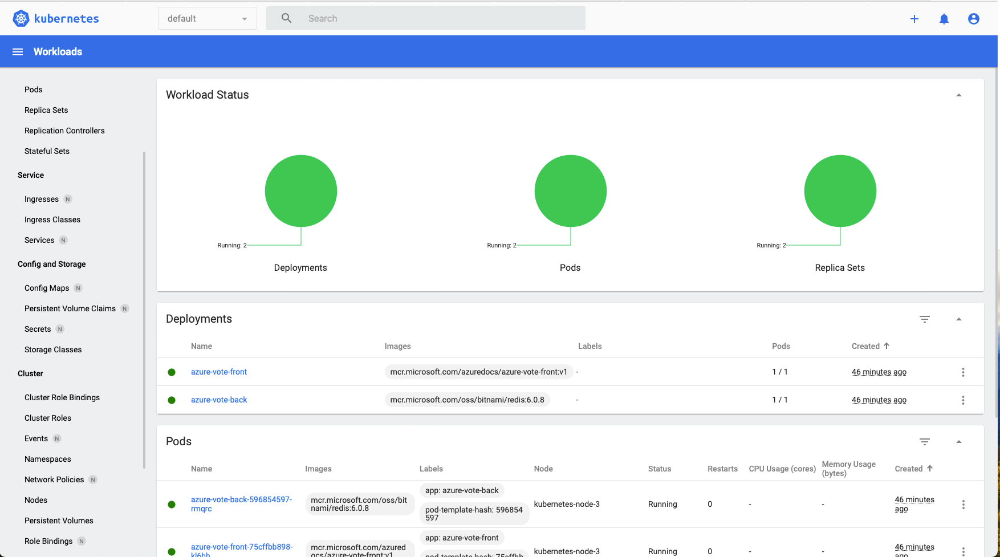
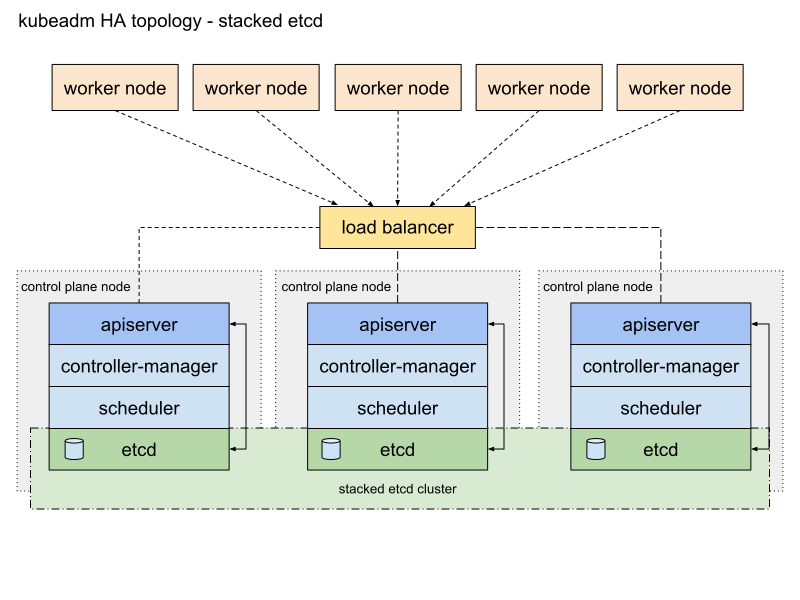

# Kubernetes from scratch

## Project Overview

This project will guide students through the complete lifecycle of setting up a Kubernetes cluster on Azure using Terraform, configuring advanced Kubernetes features, and deploying a complex microservices application. The goal is to provide a comprehensive understanding of Kubernetes, including its architecture, networking, storage, security, and monitoring.

## Project Steps

- Infrastructure Setup with Terraform
    1. Create Terraform Configuration
        
        Create a `main.tf` file to provision 3 Azure VMs:
        
    2. Create a new directory for your project and navigate into it:
        
        ```bash
        mkdir azure-kubernetes && cd azure-kubernetes
        ```
        
    3. Create a file named `providers.tf` with the following content:
        
        ```
        terraform {
          required_providers {
            azurerm = {
                source = "hashicorp/azurerm"
                version = "=3.112.0"
            }
          }
        }
        
        provider "azurerm" {
          features {}
        }
        ```
        
    4. Create a file named `main.tf` and add the Terraform configuration for the Azure resources. This includes:
        - Resource Group
        - Virtual Network
        - Subnet
        - Network Security Group
        - 3 Virtual Machines
        - Public IPs
        - Network Interfaces
        
        ```
        # Create a resource group
        resource "azurerm_resource_group" "rg" {
          name     = "kubernetes-resource-group"
          location = "East US"
        }
        
        # Create a virtual network
        resource "azurerm_virtual_network" "vnet" {
          name                = "kubernetes-vnet"
          address_space       = ["10.0.0.0/16"]
          location            = azurerm_resource_group.rg.location
          resource_group_name = azurerm_resource_group.rg.name
        }
        
        # Create a subnet
        resource "azurerm_subnet" "subnet" {
          name                 = "kubernetes-subnet"
          resource_group_name  = azurerm_resource_group.rg.name
          virtual_network_name = azurerm_virtual_network.vnet.name
          address_prefixes     = ["10.0.1.0/24"]
        }
        
        # Create a Network Security Group
        resource "azurerm_network_security_group" "nsg" {
          name                = "my-nsg"
          location            = azurerm_resource_group.rg.location
          resource_group_name = azurerm_resource_group.rg.name
        
          security_rule {
            name                       = "SSH"
            priority                   = 1001
            direction                  = "Inbound"
            access                     = "Allow"
            protocol                   = "Tcp"
            source_port_range          = "*"
            destination_port_range     = "22"
            source_address_prefix      = "*"
            destination_address_prefix = "*"
          }
        }
        
        # Create 3 VMs
        resource "azurerm_linux_virtual_machine" "vm" {
          count               = 3
          name                = "kubernetes-node-${count.index + 1}"
          resource_group_name = azurerm_resource_group.rg.name
          location            = azurerm_resource_group.rg.location
          size                = "Standard_B2s"
          admin_username      = "adminuser"
          network_interface_ids = [
            azurerm_network_interface.nic[count.index].id,
          ]
        
          admin_ssh_key {
            username   = "adminuser"
            public_key = file("~/.ssh/id_rsa.pub")  # Path to your local public key
          }
        
          os_disk {
            caching              = "ReadWrite"
            storage_account_type = "Standard_LRS"
          }
        
          source_image_reference {
            publisher = "Canonical"
            offer     = "UbuntuServer"
            sku       = "18.04-LTS"
            version   = "latest"
          }
        }
        
        # Create public IPs
        resource "azurerm_public_ip" "public_ip" {
          count               = 3
          name                = "public-ip-${count.index + 1}"
          location            = azurerm_resource_group.rg.location
          resource_group_name = azurerm_resource_group.rg.name
          allocation_method   = "Dynamic"
        }
        
        # Create network interfaces for VMs
        resource "azurerm_network_interface" "nic" {
          count               = 3
          name                = "my-nic-${count.index + 1}"
          location            = azurerm_resource_group.rg.location
          resource_group_name = azurerm_resource_group.rg.name
        
          ip_configuration {
            name                          = "internal"
            subnet_id                     = azurerm_subnet.subnet.id
            private_ip_address_allocation = "Dynamic"
            public_ip_address_id          = azurerm_public_ip.public_ip[count.index].id
          }
        }
        
        # Associate NSG with network interfaces
        resource "azurerm_network_interface_security_group_association" "nsg_association" {
          count                     = 3
          network_interface_id      = azurerm_network_interface.nic[count.index].id
          network_security_group_id = azurerm_network_security_group.nsg.id
        }
        
        # Output public IP addresses
        output "vm_public_ips" {
          value = azurerm_public_ip.public_ip[*].ip_address
        }
        ```
        
    5. Initialize Terraform:
        
        ```bash
        terraform init
        ```
        
    6. Review the planned changes:
        
        ```bash
        terraform plan
        ```
        
    7. Apply the Terraform configuration:
        
        ```bash
        terraform apply
        ```
        
    8. Note down the public IP addresses of the VMs from the Terraform output. (output part still isn’t working will fix that, but for now go to the azure portal and get the public ips)
- Kubernetes Cluster Setup
    1. Install Container Runtime
        
        SSH into each VM and install containerd:
        
        ```bash
        sudo apt-get update
        sudo apt-get install -y containerd
        sudo mkdir -p /etc/containerd
        sudo containerd config default | sudo tee /etc/containerd/config.toml
        sudo systemctl restart containerd
        
        ```
        
    2. Install Kubernetes Components
        
        ```bash
        sudo apt-get update
        sudo apt-get install -y apt-transport-https ca-certificates curl gpg
        sudo mkdir /etc/apt/keyrings
        curl -fsSL https://pkgs.k8s.io/core:/stable:/v1.30/deb/Release.key | sudo gpg --dearmor -o /etc/apt/keyrings/kubernetes-apt-keyring.gpg
        echo 'deb [signed-by=/etc/apt/keyrings/kubernetes-apt-keyring.gpg] https://pkgs.k8s.io/core:/stable:/v1.30/deb/ /' | sudo tee /etc/apt/sources.list.d/kubernetes.list
        sudo apt-get update
        sudo apt-get install -y kubelet kubeadm kubectl
        sudo apt-mark hold kubelet kubeadm kubectl
        ```
        
    3. Initialize Kubernetes Master Node
        1. On the first VM (master node):
            
            ```bash
            sudo kubeadm init --pod-network-cidr=10.244.0.0/16 --apiserver-cert-extra-sans=<control-plane-public-ip>
            ```
            
        2. Set up kubectl for the non-root user:
            
            ```bash
            mkdir -p $HOME/.kube
            sudo cp -i /etc/kubernetes/admin.conf $HOME/.kube/config
            sudo chown $(id -u):$(id -g) $HOME/.kube/config
            ```
            
        3. Install a CNI plugin (e.g., canal(calico for policy and flannel for networking):
            
            ```bash
            kubectl apply -f https://raw.githubusercontent.com/projectcalico/calico/v3.28.0/manifests/canal.yaml
            ```
            
    4. Join Worker Nodes
        
        On the master node, run:
        
        ```bash
        kubeadm token create --print-join-comma
        ```
        
        Copy the output and run it on each worker node with sudo.
        
    5. Accessing the Cluster from your local machine
        
        Creating the kubeconfig file 
        
        ```bash
          mkdir -p $HOME/.kube
          sudo cp -i /etc/kubernetes/admin.conf $HOME/.kube/config
          sudo chown $(id -u):$(id -g) $HOME/.kube/config
        ```
        
        Copy this kubeconfig file to your local machine in the location ~/.kube/config and replace the server address with the public IP of the master node
        
    6. Test if everything works fine
        
        ```bash
        kubectl create -f https://raw.githubusercontent.com/NillsF/blog/master/kubeadm/azure-vote.yml
        kubectl port-forward service/azure-vote-front 8080:80
        ```
        
        Give it a couple seconds for the pods to start, and then connect to localhost:8080 in your browser and you’ll see the azure-vote application running on your kubernetes cluster:
        
        ![demo application home page]](<assets/microservecs-demo app.png>)
        
- Installing Kubernetes Dashboard
    1. Add the helm chart repo
    2. Install kubernetes via helm chart
    
    ```bash
    # Add kubernetes-dashboard repository
    helm repo add kubernetes-dashboard https://kubernetes.github.io/dashboard/
    # Deploy a Helm Release named "kubernetes-dashboard" using the kubernetes-dashboard chart
    helm upgrade --install kubernetes-dashboard kubernetes-dashboard/kubernetes-dashboard --create-namespace --namespace kubernetes-dashboard
    ```
    
    ```bash
    kubectl -n kubernetes-dashboard port-forward svc/kubernetes-dashboard-kong-proxy 8443:443
    ```
    
    Creation of bearer token and service account is needed.
    
    ```bash
    # Create a Bearer token
    kubectl -n NAMESPACE create token SERVICE_ACCOUNT
    ```
    
    
- Advanced Kubernetes Configuration
    - Control Plan Isolation
        
        Control plane isolation in Kubernetes is crucial for several reasons:
        
        1. Security:The control plane nodes host critical components of the Kubernetes cluster, such as the API server, scheduler, and controller manager. Isolating these components from regular workloads helps prevent potential security breaches or unauthorized access.
        2. Stability:By keeping application workloads separate from control plane components, you reduce the risk of resource contention that could impact the stability and performance of core cluster functions.
        3. Resource management:Control plane nodes often have specific resource requirements. Isolating them ensures that these resources are dedicated to running the cluster's core components without interference from other workloads.
        4. Scalability:Separating the control plane allows for independent scaling of control plane components and worker nodes, which is especially important in large clusters.
        5. Upgrades and maintenance:Isolation makes it easier to perform upgrades or maintenance on control plane components without affecting application workloads.
        6. Compliance:Some regulatory standards or organizational policies may require separation of control and data planes for better governance and risk management.
        
        To simulate Importance of Control Plane isolation we will allow scheduling of pods on the control plane node and try to fetch Cluster specific data from the control plane node.
        
        7. By default, your cluster will not schedule Pods on the control plane nodes for security reasons. If you want to be able to schedule Pods on the control plane nodes, for example for a single machine Kubernetes cluster, run:
            
            ```bash
            kubectl taint nodes --all node-role.kubernetes.io/control-plane:NoSchedule-
            ```
            
            The output will look something like:
            
            ```
            node "test-01" untainted
            ...
            ```
            
            This will remove the `node-role.kubernetes.io/control-plane:NoSchedule` taint from any nodes that have it, including the control plane nodes, meaning that the scheduler will then be able to schedule Pods everywhere.
            
            > Additionally, you can execute the following command to remove the[`node.kubernetes.io/exclude-from-external-load-balancers`](https://kubernetes.io/docs/reference/labels-annotations-taints/#node-kubernetes-io-exclude-from-external-load-balancers) label from the control plane node, which excludes it from the list of backend servers:
            > 
            > 
            > ```bash
            > kubectl label nodes --all node.kubernetes.io/exclude-from-external-load-balancers-
            > ```
            > 
        8. Let’s now create a pod to get control plane resources
            
            ```bash
            apiVersion: v1
            kind: Pod
            metadata:
              name: malicious-pod
            spec:
              containers:
              - name: alpine
                image: alpine
                command: ["/bin/sh", "-c"]
                args:
                  - |
                    apk add --no-cache curl && \
                    while true; do \
                      curl --cacert /var/run/secrets/kubernetes.io/serviceaccount/ca.crt \
                      -H "Authorization: Bearer $(cat /var/run/secrets/kubernetes.io/serviceaccount/token)" \
                      https://kubernetes.default.svc.cluster.local:443/api; \
                      sleep 5; \
                    done
              restartPolicy: Always
            ```
            
            ```bash
            kubectl apply -f malicious-pod.yaml
            ```
            
        9. Observe the Impact
            
            Monitor the logs of the malicious pod to see if it can access the API server.
            
            ```bash
            kubectl logs malicious-pod
            ```
            
            ```bash
            kshitijdhara@192 Cloud admin project % kubectl delete pod busybox                                                        
            pod "busybox" deleted
            kshitijdhara@192 Cloud admin project % kubectl apply -f control-plane-isolation.yaml 
            pod/malicious-pod created
            kshitijdhara@192 Cloud admin project % kubeclt logs malicious-pod
            zsh: command not found: kubeclt
            kshitijdhara@192 Cloud admin project % kubectl logs malicious-pod
            fetch https://dl-cdn.alpinelinux.org/alpine/v3.20/main/x86_64/APKINDEX.tar.gz
            fetch https://dl-cdn.alpinelinux.org/alpine/v3.20/community/x86_64/APKINDEX.tar.gz
            (1/10) Installing ca-certificates (20240705-r0)
            (2/10) Installing brotli-libs (1.1.0-r2)
            (3/10) Installing c-ares (1.28.1-r0)
            (4/10) Installing libunistring (1.2-r0)
            (5/10) Installing libidn2 (2.3.7-r0)
            (6/10) Installing nghttp2-libs (1.62.1-r0)
            (7/10) Installing libpsl (0.21.5-r1)
            (8/10) Installing zstd-libs (1.5.6-r0)
            (9/10) Installing libcurl (8.9.0-r0)
            (10/10) Installing curl (8.9.0-r0)
            Executing busybox-1.36.1-r29.trigger
            Executing ca-certificates-20240705-r0.trigger
            OK: 13 MiB in 24 packages
              % Total    % Received % Xferd  Average Speed   Time    Time     Time  Current
                                             Dload  Upload   Total   Spent    Left  Speed
            {
              "kind": "APIVersions",
              "versions": [
                "v1"
              ],
              "serverAddressByClientCIDRs": [
                {
                  "clientCIDR": "0.0.0.0/0",
                  "serverAddress": "10.0.1.6:6443"
                }
              ]
            100   180  100   180    0     0   9193      0 --:--:-- --:--:-- --:--:--  9473
              % Total    % Received % Xferd  Average Speed   Time    Time     Time  Current
                                             Dload  Upload   Total   Spent    Left  Speed
            100   180  100   180    0     0  12124      0 --:--:-- --:--:-- --:--:-- 12857
            }{
              "kind": "APIVersions",
              "versions": [
                "v1"
              ],
              "serverAddressByClientCIDRs": [
                {
                  "clientCIDR": "0.0.0.0/0",
                  "serverAddress": "10.0.1.6:6443"
                }
              ]
              % Total    % Received % Xferd  Average Speed   Time    Time     Time  Current
                                             Dload  Upload   Total   Spent    Left  Speed
            }{
              "kind": "APIVersions",
              "versions": [
                "v1"
              ],
              "serverAddressByClientCIDRs": [
                {
                  "clientCIDR": "0.0.0.0/0",
                  "serverAddress": "10.0.1.6:6443"
                }
              ]
            100   180  100   180    0     0   6273      0 --:--:-- --:--:-- --:--:--  6428
            ```
            
        10. Reapply Control Plane Isolation (Best Practice)
            
            Reapply the taint to the control plane node to prevent scheduling of pods.
            
            ```bash
            kubectl taint nodes --all node-role.kubernetes.io/control-plane=:NoSchedule
            
            ```
            
        
        > What did we learn:
        > 
        > 1. **Security Risks**: By allowing pods to run on control plane nodes, you expose critical components to potential security breaches, as demonstrated by the malicious pod accessing the API server.
        > 2. **Resource Contention**: Running workloads on control plane nodes can lead to resource contention, affecting the stability and performance of the control plane components.
        > 3. **Best Practices**: Reapplying the taint ensures that control plane nodes are dedicated to managing the cluster, maintaining security and stability
    - Create HA Cluster
        
        Topology
        
        
        
        1. create 5 nodes on azure vm by editing the terrform code vm count from 3 → 5
        2. the setup will have 2 control plane nodes and 3 worker nodes
        3. Configure Load Balancer
            - Create an Azure Load Balancer.
            - Configure health probes and load balancing rules for ports 6443 and 443.
            - Ensure the load balancer can communicate with all control plane nodes on port 6443.
        4. Add the first control plane node to the load balancer, and test the connection:
            
            ```bash
            nc -v <LOAD_BALANCER_IP> <PORT>
            ```
            
            A connection refused error is expected because the API server is not yet running. A timeout, however, means the load balancer cannot communicate with the control plane node. If a timeout occurs, reconfigure the load balancer to communicate with the control plane node.
            
        5. Add the remaining control plane nodes to the load balancer target group.
        6. Initialise the first control plane node
        SSH into the first control plane node and initialize the control plane:
            
            ```bash
            sudo kubeadm init --control-plane-endpoint "<LOAD_BALANCER_IP>:6443" --upload-certs --pod-network-cidr=10.244.0.0/16
            ```
            
            The output looks similar to:
            
            ```bash
            ...
            You can now join any number of control-plane node by running the following command on each as a root:
                kubeadm join 192.168.0.200:6443 --token 9vr73a.a8uxyaju799qwdjv --discovery-token-ca-cert-hash sha256:7c2e69131a36ae2a042a339b33381c6d0d43887e2de83720eff5359e26aec866 --control-plane --certificate-key f8902e114ef118304e561c3ecd4d0b543adc226b7a07f675f56564185ffe0c07
            
            Please note that the certificate-key gives access to cluster sensitive data, keep it secret!
            As a safeguard, uploaded-certs will be deleted in two hours; If necessary, you can use kubeadm init phase upload-certs to reload certs afterward.
            
            Then you can join any number of worker nodes by running the following on each as root:
                kubeadm join 192.168.0.200:6443 --token 9vr73a.a8uxyaju799qwdjv --discovery-token-ca-cert-hash sha256:7c2e69131a36ae2a042a339b33381c6d0d43887e2de83720eff5359e26aec866
            ```
            
            - Copy this output to a text file. You will need it later to join control plane and worker nodes to the cluster.
            - When `-upload-certs` is used with `kubeadm init`, the certificates of the primary control plane are encrypted and uploaded in the `kubeadm-certs` Secret.
            - To re-upload the certificates and generate a new decryption key, use the following command on a control plane node that is already joined to the cluster:
                
                `sudo kubeadm init phase upload-certs --upload-certs`
                
        7. Steps for the rest of the control plane nodes
            
            For each additional control plane node you should:
            
            1. Execute the join command that was previously given to you by the `kubeadm init` output on the first node. It should look something like this:
                
                ```bash
                sudo kubeadm join 192.168.0.200:6443 --token 9vr73a.a8uxyaju799qwdjv --discovery-token-ca-cert-hash sha256:7c2e69131a36ae2a042a339b33381c6d0d43887e2de83720eff5359e26aec866 --control-plane --certificate-key f8902e114ef118304e561c3ecd4d0b543adc226b7a07f675f56564185ffe0c07
                ```
                
                - The `-control-plane` flag tells `kubeadm join` to create a new control plane.
                - The `-certificate-key ...` will cause the control plane certificates to be downloaded from the `kubeadm-certs` Secret in the cluster and be decrypted using the given key.
            
            You can join multiple control-plane nodes in parallel.
            
        8. Continue with join the worker nodes to the Cluster
        
    - Implement Ingress Controllers
        1. Install NGINX Ingress Controller:This installs the NGINX Ingress Controller with 2 replicas for high availability.
            
            ```bash
            helm repo add ingress-nginx https://kubernetes.github.io/ingress-nginx
            helm repo update
            
            helm install ingress-nginx ingress-nginx/ingress-nginx \
              --namespace ingress-nginx \
              --create-namespace \
              --set controller.replicaCount=2 \
              --set controller.nodeSelector."kubernetes\.io/os"=linux \
              --set defaultBackend.nodeSelector."kubernetes\.io/os"=linux
            ```
            
        2. Verify the installation:
            
            ```bash
            kubectl get pods -n ingress-nginx
            ```
            
        3. Get the External IP of the Ingress Controller:Look for the `ingress-nginx-controller` service and note its External IP.
            
            ```bash
            kubectl get services -n ingress-nginx
            ```
            
        4. Create an Ingress Resource:Create a file named `example-ingress.yaml`:Replace `your-domain.com` and `your-service` with your actual domain and service name.
            
            ```yaml
            apiVersion: networking.k8s.io/v1
            kind: Ingress
            metadata:
              name: example-ingress
              annotations:
                kubernetes.io/ingress.class: nginx
            spec:
              rules:
              - http:
                  paths:
                  - path: /
                    pathType: Prefix
                    backend:
                      service:
                        name: service
                        port: 
                          number: 80
            ```
            
        5. Apply the Ingress Resource:
            
            ```bash
            kubectl apply -f example-ingress.yaml
            ```
            
        6. Test the Ingress:Access your application using the domain you configured.
    - Security Best Practices
        - Implement Role-Based Access Control (RBAC)
            1. Create a Service Account:
                
                ```yaml
                apiVersion: v1
                kind: ServiceAccount
                metadata:
                  name: my-service-account
                  namespace: default
                ```
                
            2. Create a Role or ClusterRole:
                
                For namespace-specific permissions (Role):
                
                ```yaml
                apiVersion: rbac.authorization.k8s.io/v1
                kind: Role
                metadata:
                  namespace: default
                  name: pod-reader
                rules:
                - apiGroups: [""]
                  resources: ["pods"]
                  verbs: ["get", "watch", "list"]
                ```
                
                For cluster-wide permissions (ClusterRole):
                
                ```yaml
                apiVersion: rbac.authorization.k8s.io/v1
                kind: ClusterRole
                metadata:
                  name: pod-reader
                rules:
                - apiGroups: [""]
                  resources: ["pods"]
                  verbs: ["get", "watch", "list"]
                ```
                
            3. Create a RoleBinding or ClusterRoleBinding:
                
                For Role:
                
                ```yaml
                apiVersion: rbac.authorization.k8s.io/v1
                kind: RoleBinding
                metadata:
                  name: read-pods
                  namespace: default
                subjects:
                - kind: ServiceAccount
                  name: my-service-account
                  namespace: default
                roleRef:
                  kind: Role
                  name: pod-reader
                  apiGroup: rbac.authorization.k8s.io
                ```
                
                For ClusterRole:
                
                ```yaml
                apiVersion: rbac.authorization.k8s.io/v1
                kind: ClusterRoleBinding
                metadata:
                  name: read-pods
                subjects:
                - kind: ServiceAccount
                  name: my-service-account
                  namespace: default
                roleRef:
                  kind: ClusterRole
                  name: pod-reader
                  apiGroup: rbac.authorization.k8s.io
                ```
                
            4. Apply the configurations:
                
                ```yaml
                kubectl apply -f service-account.yaml
                kubectl apply -f role.yaml
                kubectl apply -f role-binding.yaml
                ```
                
            5. Use the Service Account in a Pod:
                
                ```yaml
                apiVersion: v1
                kind: Pod
                metadata:
                  name: my-pod
                spec:
                  serviceAccountName: my-service-account
                  containers:
                  - name: my-container
                    image: busybox
                    command: ['sh', '-c', 'echo Hello Kubernetes! && sleep 3600']
                ```
                
            6. Verify RBAC:
                
                ```yaml
                kubectl auth can-i get pods --as=system:serviceaccount:default:my-service-account
                ```
                
        - Network Policies
            1. **Create a Namespace**
                
                Create a namespace for your application:
                
                ```bash
                kubectl create namespace my-namespace
                ```
                
            2. **Create a Basic Network Policy**
                
                Create a file named deny-all-ingress.yaml to deny all ingress traffic by default:
                
                ```yaml
                apiVersion: networking.k8s.io/v1
                kind: NetworkPolicy
                metadata:
                  name: deny-all-ingress
                  namespace: my-namespace
                spec:
                  podSelector: {}
                  policyTypes:
                  - Ingress
                ```
                
                Apply the Network Policy:
                
                ```bash
                kubectl apply -f deny-all-ingress.yaml
                ```
                
            3. **Allow Specific Ingress Traffic**
                
                Create a file named allow-nginx-ingress.yaml to allow ingress traffic to a specific pod:
                
                ```yaml
                apiVersion: networking.k8s.io/v1
                kind: NetworkPolicy
                metadata:
                  name: allow-nginx-ingress
                  namespace: my-namespace
                spec:
                  podSelector:
                    matchLabels:
                      app: nginx
                  policyTypes:
                  - Ingress
                  ingress:
                  - from:
                    - podSelector:
                        matchLabels:
                          app: allowed-app
                    ports:
                    - protocol: TCP
                      port: 80
                ```
                
                Apply the Network Policy:
                
                ```bash
                kubectl apply -f allow-nginx-ingress.yaml
                ```
                
            4. **Allow Egress Traffic**
                
                Create a file named allow-egress.yaml to allow egress traffic from a specific pod:
                
                ```yaml
                apiVersion: networking.k8s.io/v1
                kind: NetworkPolicy
                metadata:
                  name: allow-egress
                  namespace: my-namespace
                spec:
                  podSelector:
                    matchLabels:
                      app: nginx
                  policyTypes:
                  - Egress
                  egress:
                  - to:
                    - podSelector:
                        matchLabels:
                          app: external-service
                    ports:
                    - protocol: TCP
                      port: 443
                ```
                
                Apply the Network Policy:
                
                ```bash
                kubectl apply -f allow-egress.yaml
                ```
                
            5. **Verify Network Policies**
                
                Deploy pods and verify that the network policies are enforced. For example, deploy an nginx pod:
                
                ```yaml
                apiVersion: v1
                kind: Pod
                metadata:
                  name: nginx
                  namespace: my-namespace
                  labels:
                    app: nginx
                spec:
                  containers:
                  - name: nginx
                    image: nginx
                ```
                
                Apply the pod configuration:
                
                ```bash
                kubectl apply -f nginx-pod.yaml
                ```
                
                Deploy another pod to test the ingress policy:
                
                ```yaml
                apiVersion: v1
                kind: Pod
                metadata:
                  name: test-pod
                  namespace: my-namespace
                  labels:
                    app: allowed-app
                spec:
                  containers:
                  - name: busybox
                    image: busybox
                    command: ['sh', '-c', 'sleep 3600']
                ```
                
                Apply the pod configuration:
                
                ```bash
                kubectl apply -f test-pod.yaml
                ```
                
            6. **Test Network Policies**
                
                Exec into the test pod and try to access the nginx pod:
                
                ```bash
                kubectl exec -it test-pod -n my-namespace -- wget -qO- http://nginx-pod-ip
                ```
                
                If the network policies are correctly applied, the request should succeed.
                
    - Disaster Recovery and Backup
        - Set Up etcd Backup
            1. Ensure etcd Access:Make sure you have access to the etcd nodes. In our setup, etcd runs on the control plane nodes.
            2. Install etcdctl:On each control plane node, install etcdctl if not already present:
                
                ```bash
                ETCD_VER=v3.5.1
                wget https://github.com/etcd-io/etcd/releases/download/${ETCD_VER}/etcd-${ETCD_VER}-linux-amd64.tar.gz
                tar xzvf etcd-${ETCD_VER}-linux-amd64.tar.gz
                sudo mv etcd-${ETCD_VER}-linux-amd64/etcdctl /usr/local/bin
                ```
                
            3. Set up Azure Blob Storage:Create an Azure Storage Account and a container for storing backups.
            4. Install Azure CLI:Install Azure CLI on the control plane nodes:
                
                ```bash
                curl -sL https://aka.ms/InstallAzureCLIDeb | sudo bash
                ```
                
            5. Create a Backup Script:Create a script named `etcd-backup.sh`: (Can be a task)
                
                ```bash
                #!/bin/bash
                
                *# Set variables*
                DATE=$(date +"%Y%m%d_%H%M%S")
                ETCDCTL_API=3
                ETCD_ENDPOINTS="https://127.0.0.1:2379"
                ETCDCTL_CERT="/etc/kubernetes/pki/etcd/server.crt"
                ETCDCTL_KEY="/etc/kubernetes/pki/etcd/server.key"
                ETCDCTL_CACERT="/etc/kubernetes/pki/etcd/ca.crt"
                BACKUP_DIR="/tmp/etcd_backup"
                STORAGE_ACCOUNT_NAME="your_storage_account_name"
                CONTAINER_NAME="your_container_name"
                
                *# Create backup*
                mkdir -p $BACKUP_DIR
                etcdctl --endpoints=$ETCD_ENDPOINTS \
                        --cert=$ETCDCTL_CERT \
                        --key=$ETCDCTL_KEY \
                        --cacert=$ETCDCTL_CACERT \
                        snapshot save $BACKUP_DIR/etcd-snapshot-$DATE.db
                
                *# Compress backup*
                tar -czvf $BACKUP_DIR/etcd-snapshot-$DATE.tar.gz -C $BACKUP_DIR etcd-snapshot-$DATE.db
                
                *# Upload to Azure Blob Storage*
                az storage blob upload --account-name $STORAGE_ACCOUNT_NAME \
                                       --container-name $CONTAINER_NAME \
                                       --name etcd-snapshot-$DATE.tar.gz \
                                       --file $BACKUP_DIR/etcd-snapshot-$DATE.tar.gz
                
                *# Clean up local files*
                rm -rf $BACKUP_DIR
                ```
                
            6. Make the Script Executable:
                
                ```bash
                chmod +x etcd-backup.sh
                ```
                
            7. Set up Azure Credentials:Authenticate with Azure:
                
                ```bash
                az login
                ```
                
            8. Schedule the Backup:Use cron to schedule regular backups. Edit the crontab:Add a line to run the backup daily at 2 AM: ( can be a task )
                
                ```bash
                crontab -e
                ```
                
                ```bash
                0 2 * * * /path/to/etcd-backup.sh
                ```
                
            9. Test the Backup:Run the script manually to ensure it works:
                
                ```bash
                ./etcd-backup.sh
                ```
                
            10. Implement Backup Rotation:Add logic to the script to delete old backups from Azure Blob Storage. ( can be a task )
    - Performance Tuning and Optimization
        - Node Affinity and Anti-Affinity
            1. Ensure you have a 5-node Kubernetes cluster running on Azure VMs. Then label the nodes to demonstrate affinity concepts:
                
                ```bash
                kubectl label nodes kubernetes-node-1 disktype=ssd zone=us-east-1a
                kubectl label nodes kubernetes-node-2 disktype=hdd zone=us-east-1b
                kubectl label nodes kubernetes-node-3 disktype=ssd zone=us-east-1b
                kubectl label nodes kubernetes-node-4 disktype=hdd zone=us-east-1a
                kubectl label nodes kubernetes-node-5 disktype=ssd zone=us-east-1c
                ```
                
            2. Explain Node Affinity:Node affinity allows you to constrain which nodes your pod can be scheduled on based on node labels.
            3. Demonstrate Required Node Affinity:Create a pod that must run on nodes with SSD:Apply and check where it's scheduled:
                
                ```yaml
                apiVersion: v1
                kind: Pod
                metadata:
                  name: nginx-ssd
                spec:
                  affinity:
                    nodeAffinity:
                      requiredDuringSchedulingIgnoredDuringExecution:
                        nodeSelectorTerms:
                        - matchExpressions:
                          - key: disktype
                            operator: In
                            values:
                            - ssd
                  containers:
                  - name: nginx
                    image: nginx
                ```
                
                ```bash
                kubectl apply -f nginx-ssd.yaml
                kubectl get pod nginx-ssd -o wide
                ```
                
            4. Demonstrate Preferred Node Affinity:Create a pod that prefers nodes in us-east-1a but can run elsewhere:
                
                ```yaml
                textapiVersion: v1
                kind: Pod
                metadata:
                  name: nginx-preferred-zone
                spec:
                  affinity:
                    nodeAffinity:
                      preferredDuringSchedulingIgnoredDuringExecution:
                      - weight: 1
                        preference:
                          matchExpressions:
                          - key: zone
                            operator: In
                            values:
                            - us-east-1a
                  containers:
                  - name: nginx
                    image: nginx
                ```
                
            5. Explain Node Anti-Affinity:Node anti-affinity ensures that pods are not scheduled on nodes with certain labels.
            6. Demonstrate Node Anti-Affinity:Create a pod that avoids nodes with HDD:
                
                ```yaml
                apiVersion: v1
                kind: Pod
                metadata:
                  name: nginx-anti-hdd
                spec:
                  affinity:
                    nodeAffinity:
                      requiredDuringSchedulingIgnoredDuringExecution:
                        nodeSelectorTerms:
                        - matchExpressions:
                          - key: disktype
                            operator: NotIn
                            values:
                            - hdd
                  containers:
                  - name: nginx
                    image: nginx
                ```
                
            7. Combine Affinity and Anti-Affinity:Create a pod that must run on SSD nodes but prefers not to be in us-east-1b:
                
                ```yaml
                apiVersion: v1
                kind: Pod
                metadata:
                  name: nginx-complex-affinity
                spec:
                  affinity:
                    nodeAffinity:
                      requiredDuringSchedulingIgnoredDuringExecution:
                        nodeSelectorTerms:
                        - matchExpressions:
                          - key: disktype
                            operator: In
                            values:
                            - ssd
                      preferredDuringSchedulingIgnoredDuringExecution:
                      - weight: 1
                        preference:
                          matchExpressions:
                          - key: zone
                            operator: NotIn
                            values:
                            - us-east-1b
                  containers:
                  - name: nginx
                    image: nginx
                ```
                
            8. Demonstrate Pod Affinity:Pod affinity allows you to influence pod scheduling based on the labels on other pods running on the node.
                
                ```yaml
                apiVersion: v1
                kind: Pod
                metadata:
                  name: nginx-with-pod-affinity
                spec:
                  affinity:
                    podAffinity:
                      requiredDuringSchedulingIgnoredDuringExecution:
                      - labelSelector:
                          matchExpressions:
                          - key: app
                            operator: In
                            values:
                            - web-store
                        topologyKey: "kubernetes.io/hostname"
                  containers:
                  - name: nginx
                    image: nginx
                ```
                
            9. Demonstrate Pod Anti-Affinity:Pod anti-affinity helps in spreading pods across nodes.
                
                ```yaml
                apiVersion: v1
                kind: Pod
                metadata:
                  name: nginx-with-pod-anti-affinity
                spec:
                  affinity:
                    podAntiAffinity:
                      requiredDuringSchedulingIgnoredDuringExecution:
                      - labelSelector:
                          matchExpressions:
                          - key: app
                            operator: In
                            values:
                            - web-store
                        topologyKey: "kubernetes.io/hostname"
                  containers:
                  - name: nginx
                    image: nginx
                ```
                
            10. Practical Exercise:Have students create a deployment that:
                - Runs on SSD nodes
                - Prefers us-east-1a zone
                - Ensures no more than one pod per node
                - Has pod anti-affinity with pods labeled "app=database"
            11. Performance Impact:Discuss how affinity rules can impact cluster performance and resource utilization.https://overcast.blog/mastering-node-affinity-and-anti-affinity-in-kubernetes-db769af90f5c?gi=2015811deb17
            12. Best Practices that can be discussed:
                - Use node affinity for hardware requirements
                - Use pod affinity for related services
                - Use pod anti-affinity for high availability
                - Be cautious with required rules as they can prevent scheduling
        1. Optimize Resource Requests and Limits ( better done in Cloud Native)
    - Implement Auto-Scaling
        1. Enable Metrics Server
            
            ```bash
            kubectl apply -f https://github.com/kubernetes-sigs/metrics-server/releases/latest/download/components.yaml
            ```
            
        2. Create a deployment with horizontal pod autoscaler
    - Configure Persistent Storage ( not that interesting only exec commands )
        1. Install Azure CSI Driver
        2. Create a storage class 
        3. Create a Persistant Volume
        4. Creata a Persistant Volume Claim
        5. Attach Persistant volume Claim to a Pod
    - Set Up Monitoring with Prometheus and Grafana
        1. Add the Prometheus community Helm repository:
            
            ```bash
            helm repo add prometheus-community https://prometheus-community.github.io/helm-charts
            helm repo update
            ```
            
        2. Create a monitoring namespace:
            
            ```bash
            kubectl create namespace monitoring
            ```
            
        3. Create a `values-monitoring.yaml` file with the following content:
            
            ```yaml
            prometheus:
              prometheusSpec:
                scrapeInterval: 10s
                evaluationInterval: 30s
            
            grafana:
              persistence:
                enabled: true
              dashboardProviders:
                dashboardproviders.yaml:
                  apiVersion: 1
                  providers:
                    - name: 'default'
                      orgId: 1
                      folder: ''
                      type: file
                      disableDeletion: false
                      editable: true
                      options:
                        path: /var/lib/grafana/dashboards/default
              dashboards:
                default:
                  nginx-ingress:
                    gnetId: 9614
                    revision: 1
                    datasource: Prometheus
                  k8s-cluster:
                    gnetId: 12575
                    revision: 1
                    datasource: Prometheus
            ```
            
        4. Install the Prometheus stack using Helm:
            
            ```bash
            helm install promstack prometheus-community/kube-prometheus-stack \
              --namespace monitoring \
              --version 52.1.0 \
              -f values-monitoring.yaml
            ```
            
        5. Verify the installation:
            
            ```bash
            kubectl get pods -n monitoring
            ```
            
        6. Set up port-forwarding to access Grafana:
            
            ```bash
            kubectl port-forward -n monitoring svc/promstack-grafana 3000:80
            ```
            
        7. Access Grafana:Open a web browser and go to `http://localhost:3000`. The default credentials are:
            - Username: admin
            - Password: prom-operator (you should change this)
        8. Configure Ingress for Grafana (optional):Create an Ingress resource for Grafana to access it externally. Create a file named `grafana-ingress.yaml`:
            
            ```yaml
            apiVersion: networking.k8s.io/v1
            kind: Ingress
            metadata:
              name: grafana-ingress
              namespace: monitoring
              annotations:
                kubernetes.io/ingress.class: nginx
            spec:
              rules:
              - host: grafana.yourdomain.com
                http:
                  paths:
                  - path: /
                    pathType: Prefix
                    backend:
                      service:
                        name: promstack-grafana
                        port: 
                          number: 80
            ```
            
            Apply the Ingress:
            
            ```bash
            kubectl apply -f grafana-ingress.yaml
            ```
            
        9. Configure Prometheus to scrape NGINX Ingress Controller metrics:Create a file named `nginx-ingress-servicemonitor.yaml`:
            
            ```yaml
            apiVersion: monitoring.coreos.com/v1
            kind: ServiceMonitor
            metadata:
              name: nginx-ingress-controller
              namespace: monitoring
              labels:
                release: promstack
            spec:
              selector:
                matchLabels:
                  app.kubernetes.io/name: ingress-nginx
              namespaceSelector:
                matchNames:
                - ingress-nginx
              endpoints:
              - port: metrics
                interval: 15s
            ```
            
            Apply the ServiceMonitor:
            
            ```yaml
            kubectl apply -f nginx-ingress-servicemonitor.yaml
            ```
            
- Deploy a Complex Microservices Application
    
    <aside>
    💡 Deploy a sample microservices application (e.g., Sock Shop):
    
    </aside>
    
    ```yaml
    # Copyright 2018 Google LLC
    #
    # Licensed under the Apache License, Version 2.0 (the "License");
    # you may not use this file except in compliance with the License.
    # You may obtain a copy of the License at
    #
    #      http://www.apache.org/licenses/LICENSE-2.0
    #
    # Unless required by applicable law or agreed to in writing, software
    # distributed under the License is distributed on an "AS IS" BASIS,
    # WITHOUT WARRANTIES OR CONDITIONS OF ANY KIND, either express or implied.
    # See the License for the specific language governing permissions and
    # limitations under the License.
    
    # ----------------------------------------------------------
    # WARNING: This file is autogenerated. Do not manually edit.
    # ----------------------------------------------------------
    
    # [START gke_release_kubernetes_manifests_microservices_demo]
    ---
    apiVersion: apps/v1
    kind: Deployment
    metadata:
      name: currencyservice
      labels:
        app: currencyservice
    spec:
      selector:
        matchLabels:
          app: currencyservice
      template:
        metadata:
          labels:
            app: currencyservice
        spec:
          serviceAccountName: currencyservice
          terminationGracePeriodSeconds: 5
          securityContext:
            fsGroup: 1000
            runAsGroup: 1000
            runAsNonRoot: true
            runAsUser: 1000
          containers:
          - name: server
            securityContext:
              allowPrivilegeEscalation: false
              capabilities:
                drop:
                  - ALL
              privileged: false
              readOnlyRootFilesystem: true
            image: gcr.io/google-samples/microservices-demo/currencyservice:v0.10.0
            ports:
            - name: grpc
              containerPort: 7000
            env:
            - name: PORT
              value: "7000"
            - name: DISABLE_PROFILER
              value: "1"
            readinessProbe:
              grpc:
                port: 7000
            livenessProbe:
              grpc:
                port: 7000
            resources:
              requests:
                cpu: 100m
                memory: 64Mi
              limits:
                cpu: 200m
                memory: 128Mi
    ---
    apiVersion: v1
    kind: Service
    metadata:
      name: currencyservice
      labels:
        app: currencyservice
    spec:
      type: ClusterIP
      selector:
        app: currencyservice
      ports:
      - name: grpc
        port: 7000
        targetPort: 7000
    ---
    apiVersion: v1
    kind: ServiceAccount
    metadata:
      name: currencyservice
    ---
    apiVersion: apps/v1
    kind: Deployment
    metadata:
      name: loadgenerator
      labels:
        app: loadgenerator
    spec:
      selector:
        matchLabels:
          app: loadgenerator
      replicas: 1
      template:
        metadata:
          labels:
            app: loadgenerator
          annotations:
            sidecar.istio.io/rewriteAppHTTPProbers: "true"
        spec:
          serviceAccountName: loadgenerator
          terminationGracePeriodSeconds: 5
          restartPolicy: Always
          securityContext:
            fsGroup: 1000
            runAsGroup: 1000
            runAsNonRoot: true
            runAsUser: 1000
          initContainers:
          - command:
            - /bin/sh
            - -exc
            - |
              MAX_RETRIES=12
              RETRY_INTERVAL=10
              for i in $(seq 1 $MAX_RETRIES); do
                echo "Attempt $i: Pinging frontend: ${FRONTEND_ADDR}..."
                STATUSCODE=$(wget --server-response http://${FRONTEND_ADDR} 2>&1 | awk '/^  HTTP/{print $2}')
                if [ $STATUSCODE -eq 200 ]; then
                    echo "Frontend is reachable."
                    exit 0
                fi
                echo "Error: Could not reach frontend - Status code: ${STATUSCODE}"
                sleep $RETRY_INTERVAL
              done
              echo "Failed to reach frontend after $MAX_RETRIES attempts."
              exit 1
            name: frontend-check
            securityContext:
              allowPrivilegeEscalation: false
              capabilities:
                drop:
                  - ALL
              privileged: false
              readOnlyRootFilesystem: true
            image: busybox:latest
            env:
            - name: FRONTEND_ADDR
              value: "frontend:80"
          containers:
          - name: main
            securityContext:
              allowPrivilegeEscalation: false
              capabilities:
                drop:
                  - ALL
              privileged: false
              readOnlyRootFilesystem: true
            image: gcr.io/google-samples/microservices-demo/loadgenerator:v0.10.0
            env:
            - name: FRONTEND_ADDR
              value: "frontend:80"
            - name: USERS
              value: "10"
            resources:
              requests:
                cpu: 300m
                memory: 256Mi
              limits:
                cpu: 500m
                memory: 512Mi
    ---
    apiVersion: v1
    kind: ServiceAccount
    metadata:
      name: loadgenerator
    ---
    apiVersion: apps/v1
    kind: Deployment
    metadata:
      name: productcatalogservice
      labels:
        app: productcatalogservice
    spec:
      selector:
        matchLabels:
          app: productcatalogservice
      template:
        metadata:
          labels:
            app: productcatalogservice
        spec:
          serviceAccountName: productcatalogservice
          terminationGracePeriodSeconds: 5
          securityContext:
            fsGroup: 1000
            runAsGroup: 1000
            runAsNonRoot: true
            runAsUser: 1000
          containers:
          - name: server
            securityContext:
              allowPrivilegeEscalation: false
              capabilities:
                drop:
                  - ALL
              privileged: false
              readOnlyRootFilesystem: true
            image: gcr.io/google-samples/microservices-demo/productcatalogservice:v0.10.0
            ports:
            - containerPort: 3550
            env:
            - name: PORT
              value: "3550"
            - name: DISABLE_PROFILER
              value: "1"
            readinessProbe:
              grpc:
                port: 3550
            livenessProbe:
              grpc:
                port: 3550
            resources:
              requests:
                cpu: 100m
                memory: 64Mi
              limits:
                cpu: 200m
                memory: 128Mi
    ---
    apiVersion: v1
    kind: Service
    metadata:
      name: productcatalogservice
      labels:
        app: productcatalogservice
    spec:
      type: ClusterIP
      selector:
        app: productcatalogservice
      ports:
      - name: grpc
        port: 3550
        targetPort: 3550
    ---
    apiVersion: v1
    kind: ServiceAccount
    metadata:
      name: productcatalogservice
    ---
    apiVersion: apps/v1
    kind: Deployment
    metadata:
      name: checkoutservice
      labels:
        app: checkoutservice
    spec:
      selector:
        matchLabels:
          app: checkoutservice
      template:
        metadata:
          labels:
            app: checkoutservice
        spec:
          serviceAccountName: checkoutservice
          securityContext:
            fsGroup: 1000
            runAsGroup: 1000
            runAsNonRoot: true
            runAsUser: 1000
          containers:
            - name: server
              securityContext:
                allowPrivilegeEscalation: false
                capabilities:
                  drop:
                    - ALL
                privileged: false
                readOnlyRootFilesystem: true
              image: gcr.io/google-samples/microservices-demo/checkoutservice:v0.10.0
              ports:
              - containerPort: 5050
              readinessProbe:
                grpc:
                  port: 5050
              livenessProbe:
                grpc:
                  port: 5050
              env:
              - name: PORT
                value: "5050"
              - name: PRODUCT_CATALOG_SERVICE_ADDR
                value: "productcatalogservice:3550"
              - name: SHIPPING_SERVICE_ADDR
                value: "shippingservice:50051"
              - name: PAYMENT_SERVICE_ADDR
                value: "paymentservice:50051"
              - name: EMAIL_SERVICE_ADDR
                value: "emailservice:5000"
              - name: CURRENCY_SERVICE_ADDR
                value: "currencyservice:7000"
              - name: CART_SERVICE_ADDR
                value: "cartservice:7070"
              resources:
                requests:
                  cpu: 100m
                  memory: 64Mi
                limits:
                  cpu: 200m
                  memory: 128Mi
    ---
    apiVersion: v1
    kind: Service
    metadata:
      name: checkoutservice
      labels:
        app: checkoutservice
    spec:
      type: ClusterIP
      selector:
        app: checkoutservice
      ports:
      - name: grpc
        port: 5050
        targetPort: 5050
    ---
    apiVersion: v1
    kind: ServiceAccount
    metadata:
      name: checkoutservice
    ---
    apiVersion: apps/v1
    kind: Deployment
    metadata:
      name: shippingservice
      labels:
        app: shippingservice
    spec:
      selector:
        matchLabels:
          app: shippingservice
      template:
        metadata:
          labels:
            app: shippingservice
        spec:
          serviceAccountName: shippingservice
          securityContext:
            fsGroup: 1000
            runAsGroup: 1000
            runAsNonRoot: true
            runAsUser: 1000
          containers:
          - name: server
            securityContext:
              allowPrivilegeEscalation: false
              capabilities:
                drop:
                  - ALL
              privileged: false
              readOnlyRootFilesystem: true
            image: gcr.io/google-samples/microservices-demo/shippingservice:v0.10.0
            ports:
            - containerPort: 50051
            env:
            - name: PORT
              value: "50051"
            - name: DISABLE_PROFILER
              value: "1"
            readinessProbe:
              periodSeconds: 5
              grpc:
                port: 50051
            livenessProbe:
              grpc:
                port: 50051
            resources:
              requests:
                cpu: 100m
                memory: 64Mi
              limits:
                cpu: 200m
                memory: 128Mi
    ---
    apiVersion: v1
    kind: Service
    metadata:
      name: shippingservice
      labels:
        app: shippingservice
    spec:
      type: ClusterIP
      selector:
        app: shippingservice
      ports:
      - name: grpc
        port: 50051
        targetPort: 50051
    ---
    apiVersion: v1
    kind: ServiceAccount
    metadata:
      name: shippingservice
    ---
    apiVersion: apps/v1
    kind: Deployment
    metadata:
      name: cartservice
      labels:
        app: cartservice
    spec:
      selector:
        matchLabels:
          app: cartservice
      template:
        metadata:
          labels:
            app: cartservice
        spec:
          serviceAccountName: cartservice
          terminationGracePeriodSeconds: 5
          securityContext:
            fsGroup: 1000
            runAsGroup: 1000
            runAsNonRoot: true
            runAsUser: 1000
          containers:
          - name: server
            securityContext:
              allowPrivilegeEscalation: false
              capabilities:
                drop:
                  - ALL
              privileged: false
              readOnlyRootFilesystem: true
            image: gcr.io/google-samples/microservices-demo/cartservice:v0.10.0
            ports:
            - containerPort: 7070
            env:
            - name: REDIS_ADDR
              value: "redis-cart:6379"
            resources:
              requests:
                cpu: 200m
                memory: 64Mi
              limits:
                cpu: 300m
                memory: 128Mi
            readinessProbe:
              initialDelaySeconds: 15
              grpc:
                port: 7070
            livenessProbe:
              initialDelaySeconds: 15
              periodSeconds: 10
              grpc:
                port: 7070
    ---
    apiVersion: v1
    kind: Service
    metadata:
      name: cartservice
      labels:
        app: cartservice
    spec:
      type: ClusterIP
      selector:
        app: cartservice
      ports:
      - name: grpc
        port: 7070
        targetPort: 7070
    ---
    apiVersion: v1
    kind: ServiceAccount
    metadata:
      name: cartservice
    ---
    apiVersion: apps/v1
    kind: Deployment
    metadata:
      name: redis-cart
      labels:
        app: redis-cart
    spec:
      selector:
        matchLabels:
          app: redis-cart
      template:
        metadata:
          labels:
            app: redis-cart
        spec:
          securityContext:
            fsGroup: 1000
            runAsGroup: 1000
            runAsNonRoot: true
            runAsUser: 1000
          containers:
          - name: redis
            securityContext:
              allowPrivilegeEscalation: false
              capabilities:
                drop:
                  - ALL
              privileged: false
              readOnlyRootFilesystem: true
            image: redis:alpine
            ports:
            - containerPort: 6379
            readinessProbe:
              periodSeconds: 5
              tcpSocket:
                port: 6379
            livenessProbe:
              periodSeconds: 5
              tcpSocket:
                port: 6379
            volumeMounts:
            - mountPath: /data
              name: redis-data
            resources:
              limits:
                memory: 256Mi
                cpu: 125m
              requests:
                cpu: 70m
                memory: 200Mi
          volumes:
          - name: redis-data
            emptyDir: {}
    ---
    apiVersion: v1
    kind: Service
    metadata:
      name: redis-cart
      labels:
        app: redis-cart
    spec:
      type: ClusterIP
      selector:
        app: redis-cart
      ports:
      - name: tcp-redis
        port: 6379
        targetPort: 6379
    ---
    apiVersion: apps/v1
    kind: Deployment
    metadata:
      name: emailservice
      labels:
        app: emailservice
    spec:
      selector:
        matchLabels:
          app: emailservice
      template:
        metadata:
          labels:
            app: emailservice
        spec:
          serviceAccountName: emailservice
          terminationGracePeriodSeconds: 5
          securityContext:
            fsGroup: 1000
            runAsGroup: 1000
            runAsNonRoot: true
            runAsUser: 1000
          containers:
          - name: server
            securityContext:
              allowPrivilegeEscalation: false
              capabilities:
                drop:
                  - ALL
              privileged: false
              readOnlyRootFilesystem: true
            image: gcr.io/google-samples/microservices-demo/emailservice:v0.10.0
            ports:
            - containerPort: 8080
            env:
            - name: PORT
              value: "8080"
            - name: DISABLE_PROFILER
              value: "1"
            readinessProbe:
              periodSeconds: 5
              grpc:
                port: 8080
            livenessProbe:
              periodSeconds: 5
              grpc:
                port: 8080
            resources:
              requests:
                cpu: 100m
                memory: 64Mi
              limits:
                cpu: 200m
                memory: 128Mi
    ---
    apiVersion: v1
    kind: Service
    metadata:
      name: emailservice
      labels:
        app: emailservice
    spec:
      type: ClusterIP
      selector:
        app: emailservice
      ports:
      - name: grpc
        port: 5000
        targetPort: 8080
    ---
    apiVersion: v1
    kind: ServiceAccount
    metadata:
      name: emailservice
    ---
    apiVersion: apps/v1
    kind: Deployment
    metadata:
      name: paymentservice
      labels:
        app: paymentservice
    spec:
      selector:
        matchLabels:
          app: paymentservice
      template:
        metadata:
          labels:
            app: paymentservice
        spec:
          serviceAccountName: paymentservice
          terminationGracePeriodSeconds: 5
          securityContext:
            fsGroup: 1000
            runAsGroup: 1000
            runAsNonRoot: true
            runAsUser: 1000
          containers:
          - name: server
            securityContext:
              allowPrivilegeEscalation: false
              capabilities:
                drop:
                  - ALL
              privileged: false
              readOnlyRootFilesystem: true
            image: gcr.io/google-samples/microservices-demo/paymentservice:v0.10.0
            ports:
            - containerPort: 50051
            env:
            - name: PORT
              value: "50051"
            - name: DISABLE_PROFILER
              value: "1"
            readinessProbe:
              grpc:
                port: 50051
            livenessProbe:
              grpc:
                port: 50051
            resources:
              requests:
                cpu: 100m
                memory: 64Mi
              limits:
                cpu: 200m
                memory: 128Mi
    ---
    apiVersion: v1
    kind: Service
    metadata:
      name: paymentservice
      labels:
        app: paymentservice
    spec:
      type: ClusterIP
      selector:
        app: paymentservice
      ports:
      - name: grpc
        port: 50051
        targetPort: 50051
    ---
    apiVersion: v1
    kind: ServiceAccount
    metadata:
      name: paymentservice
    ---
    apiVersion: apps/v1
    kind: Deployment
    metadata:
      name: frontend
      labels:
        app: frontend
    spec:
      selector:
        matchLabels:
          app: frontend
      template:
        metadata:
          labels:
            app: frontend
          annotations:
            sidecar.istio.io/rewriteAppHTTPProbers: "true"
        spec:
          serviceAccountName: frontend
          securityContext:
            fsGroup: 1000
            runAsGroup: 1000
            runAsNonRoot: true
            runAsUser: 1000
          containers:
            - name: server
              securityContext:
                allowPrivilegeEscalation: false
                capabilities:
                  drop:
                    - ALL
                privileged: false
                readOnlyRootFilesystem: true
              image: gcr.io/google-samples/microservices-demo/frontend:v0.10.0
              ports:
              - containerPort: 8080
              readinessProbe:
                initialDelaySeconds: 10
                httpGet:
                  path: "/_healthz"
                  port: 8080
                  httpHeaders:
                  - name: "Cookie"
                    value: "shop_session-id=x-readiness-probe"
              livenessProbe:
                initialDelaySeconds: 10
                httpGet:
                  path: "/_healthz"
                  port: 8080
                  httpHeaders:
                  - name: "Cookie"
                    value: "shop_session-id=x-liveness-probe"
              env:
              - name: PORT
                value: "8080"
              - name: PRODUCT_CATALOG_SERVICE_ADDR
                value: "productcatalogservice:3550"
              - name: CURRENCY_SERVICE_ADDR
                value: "currencyservice:7000"
              - name: CART_SERVICE_ADDR
                value: "cartservice:7070"
              - name: RECOMMENDATION_SERVICE_ADDR
                value: "recommendationservice:8080"
              - name: SHIPPING_SERVICE_ADDR
                value: "shippingservice:50051"
              - name: CHECKOUT_SERVICE_ADDR
                value: "checkoutservice:5050"
              - name: AD_SERVICE_ADDR
                value: "adservice:9555"
              - name: SHOPPING_ASSISTANT_SERVICE_ADDR
                value: "shoppingassistantservice:80"
              # # ENV_PLATFORM: One of: local, gcp, aws, azure, onprem, alibaba
              # # When not set, defaults to "local" unless running in GKE, otherwies auto-sets to gcp
              # - name: ENV_PLATFORM
              #   value: "aws"
              - name: ENABLE_PROFILER
                value: "0"
              # - name: CYMBAL_BRANDING
              #   value: "true"
              # - name: ENABLE_ASSISTANT
              #   value: "true"
              # - name: FRONTEND_MESSAGE
              #   value: "Replace this with a message you want to display on all pages."
              # As part of an optional Google Cloud demo, you can run an optional microservice called the "packaging service".
              # - name: PACKAGING_SERVICE_URL
              #   value: "" # This value would look like "http://123.123.123"
              resources:
                requests:
                  cpu: 100m
                  memory: 64Mi
                limits:
                  cpu: 200m
                  memory: 128Mi
    ---
    apiVersion: v1
    kind: Service
    metadata:
      name: frontend
      labels:
        app: frontend
    spec:
      type: ClusterIP
      selector:
        app: frontend
      ports:
      - name: http
        port: 80
        targetPort: 8080
    # ---
    # apiVersion: v1
    # kind: Service
    # metadata:
    #   name: frontend-external
    #   labels:
    #     app: frontend
    # spec:
    #   type: LoadBalancer
    #   selector:
    #     app: frontend
    #   ports:
    #   - name: http
    #     port: 80
    #     targetPort: 8080
    ---
    apiVersion: v1
    kind: ServiceAccount
    metadata:
      name: frontend
    ---
    apiVersion: apps/v1
    kind: Deployment
    metadata:
      name: recommendationservice
      labels:
        app: recommendationservice
    spec:
      selector:
        matchLabels:
          app: recommendationservice
      template:
        metadata:
          labels:
            app: recommendationservice
        spec:
          serviceAccountName: recommendationservice
          terminationGracePeriodSeconds: 5
          securityContext:
            fsGroup: 1000
            runAsGroup: 1000
            runAsNonRoot: true
            runAsUser: 1000
          containers:
          - name: server
            securityContext:
              allowPrivilegeEscalation: false
              capabilities:
                drop:
                  - ALL
              privileged: false
              readOnlyRootFilesystem: true
            image: gcr.io/google-samples/microservices-demo/recommendationservice:v0.10.0
            ports:
            - containerPort: 8080
            readinessProbe:
              periodSeconds: 5
              grpc:
                port: 8080
            livenessProbe:
              periodSeconds: 5
              grpc:
                port: 8080
            env:
            - name: PORT
              value: "8080"
            - name: PRODUCT_CATALOG_SERVICE_ADDR
              value: "productcatalogservice:3550"
            - name: DISABLE_PROFILER
              value: "1"
            resources:
              requests:
                cpu: 100m
                memory: 220Mi
              limits:
                cpu: 200m
                memory: 450Mi
    ---
    apiVersion: v1
    kind: Service
    metadata:
      name: recommendationservice
      labels:
        app: recommendationservice
    spec:
      type: ClusterIP
      selector:
        app: recommendationservice
      ports:
      - name: grpc
        port: 8080
        targetPort: 8080
    ---
    apiVersion: v1
    kind: ServiceAccount
    metadata:
      name: recommendationservice
    ---
    apiVersion: apps/v1
    kind: Deployment
    metadata:
      name: adservice
      labels:
        app: adservice
    spec:
      selector:
        matchLabels:
          app: adservice
      template:
        metadata:
          labels:
            app: adservice
        spec:
          serviceAccountName: adservice
          terminationGracePeriodSeconds: 5
          securityContext:
            fsGroup: 1000
            runAsGroup: 1000
            runAsNonRoot: true
            runAsUser: 1000
          containers:
          - name: server
            securityContext:
              allowPrivilegeEscalation: false
              capabilities:
                drop:
                  - ALL
              privileged: false
              readOnlyRootFilesystem: true
            image: gcr.io/google-samples/microservices-demo/adservice:v0.10.0
            ports:
            - containerPort: 9555
            env:
            - name: PORT
              value: "9555"
            resources:
              requests:
                cpu: 200m
                memory: 180Mi
              limits:
                cpu: 300m
                memory: 300Mi
            readinessProbe:
              initialDelaySeconds: 20
              periodSeconds: 15
              grpc:
                port: 9555
            livenessProbe:
              initialDelaySeconds: 20
              periodSeconds: 15
              grpc:
                port: 9555
    ---
    apiVersion: v1
    kind: Service
    metadata:
      name: adservice
      labels:
        app: adservice
    spec:
      type: ClusterIP
      selector:
        app: adservice
      ports:
      - name: grpc
        port: 9555
        targetPort: 9555
    ---
    apiVersion: v1
    kind: ServiceAccount
    metadata:
      name: adservice
    # [END gke_release_kubernetes_manifests_microservices_demo]
    
    ```
    
- CI/CD Pipeline Integration ( in Cloud Native)
    1. Set Up a CI/CD Pipeline with Azure DevOps
- Troubleshooting and Debugging
    1. Common Issues and Solutions
        1. Network issues
        2. Pod crashes
        3. Resource exhaustion
    2. Debugging Tools
        1. kubectl logs
        2. kubectl exec
        3. kubectl describe

---

## Test cases

- **Infrastructure Setup with Terraform**
    - **Checkpoint 1.1: Terraform Initialization**
        - **Command:** `terraform init`
        - **Expected Output:** Initialization output confirming that Terraform has been successfully initialized, including downloading providers and setting up the backend.
        
        ```bash
        Initializing the backend...
        Initializing provider plugins...
        - Reusing previous version of hashicorp/azurerm from the dependency lock file
        - Using previously-installed hashicorp/azurerm v3.112.0
        
        Terraform has been successfully initialized!
        
        You may now begin working with Terraform. Try running "terraform plan" to see
        any changes that are required for your infrastructure. All Terraform commands
        should now work.
        
        If you ever set or change modules or backend configuration for Terraform,
        rerun this command to reinitialize your working directory. If you forget, other
        commands will detect it and remind you to do so if necessary.
        ```
        
    - **Checkpoint 1.2: Terraform Plan ( grader check)**
        - **Command:** `terraform plan`
        - **Expected Output:** A detailed plan showing the resources to be created with no errors. Ensure that resources like VMs, VNet, Subnets, NSG, and Public IPs are listed.
        
        > compare the values with a pre-existing terraform plan -out file
        > 
        
        [Terraform plan file reference file](assets/terraform-plan.txt)
        
    - **Checkpoint 1.3: Terraform Apply**
        - **Command:** `terraform apply`
        - **Expected Output:** Confirmation that the resources have been successfully created, with output similar to "Apply complete! Resources: X added, 0 changed, 0 destroyed."
        
        ```bash
        Apply complete! Resources: 22 added, 0 changed, 0 destroyed.
        
        Outputs:
        
        vm_private_ips = [
          "10.0.1.6",
          "10.0.1.5",
          "10.0.1.4",
        ]
        vm_public_ips = [
          "",
          "",
          "",
        ]
        
        ```
        
    - **Checkpoint 1.4: Retrieving Public IPs**
        - **Command:** `terraform refresh && terraform output vm_public_ips`
        - **Expected Output:** List of public IP addresses for the VMs, confirming they are correctly provisioned.
        
        ```bash
        Outputs:
        
        vm_private_ips = [
          "10.0.1.6",
          "10.0.1.5",
          "10.0.1.4",
        ]
        vm_public_ips = [
          "20.185.226.159",
          "20.185.226.247",
          "20.185.226.165",
        ]
        kshitijdhara@192 terraform % terraform output vm_public_ips
        [
          "20.185.226.159",
          "20.185.226.247",
          "20.185.226.165",
        ]
        ```
        
- **Kubernetes Cluster Setup**
    - **Checkpoint 2.1: Container Runtime Installation**
        - **Command:** `sudo systemctl status containerd`
        - **Expected Output:** `Active: active (running)` indicating that `containerd` is correctly installed and running.
        
        ```bash
        adminuser@kubernetes-node-1:~$ sudo systemctl status containerd
        ● containerd.service - containerd container runtime
             Loaded: loaded (/lib/systemd/system/containerd.service; enabled; vendor preset: enabled)
             Active: active (running) since Tue 2024-08-13 07:24:51 UTC; 4min 8s ago
               Docs: https://containerd.io
           Main PID: 2276 (containerd)
              Tasks: 8
             Memory: 19.6M
             CGroup: /system.slice/containerd.service
                     └─2276 /usr/bin/containerd
        
        Aug 13 07:24:51 kubernetes-node-1 containerd[2276]: time="2024-08-13T07:24:51.180921147Z" level=info msg=serving... address=>
        Aug 13 07:24:51 kubernetes-node-1 containerd[2276]: time="2024-08-13T07:24:51.181022050Z" level=info msg="Start subscribing >
        Aug 13 07:24:51 kubernetes-node-1 containerd[2276]: time="2024-08-13T07:24:51.181069452Z" level=info msg="Start recovering s>
        Aug 13 07:24:51 kubernetes-node-1 containerd[2276]: time="2024-08-13T07:24:51.181136154Z" level=info msg="Start event monito>
        Aug 13 07:24:51 kubernetes-node-1 containerd[2276]: time="2024-08-13T07:24:51.181165954Z" level=info msg="Start snapshots sy>
        Aug 13 07:24:51 kubernetes-node-1 containerd[2276]: time="2024-08-13T07:24:51.181179855Z" level=info msg="Start cni network >
        Aug 13 07:24:51 kubernetes-node-1 containerd[2276]: time="2024-08-13T07:24:51.181191755Z" level=info msg="Start streaming se>
        Aug 13 07:24:51 kubernetes-node-1 systemd[1]: Started containerd container runtime.
        Aug 13 07:24:51 kubernetes-node-1 containerd[2276]: time="2024-08-13T07:24:51.182936906Z" level=info msg="containerd success">
        
        adminuser@kubernetes-node-2:~$ sudo systemctl status containerd
        ● containerd.service - containerd container runtime
             Loaded: loaded (/lib/systemd/system/containerd.service; enabled; vendor preset: enabled)
             Active: active (running) since Tue 2024-08-13 07:25:20 UTC; 4min 32s ago
               Docs: https://containerd.io
           Main PID: 2289 (containerd)
              Tasks: 8
             Memory: 17.0M
             CGroup: /system.slice/containerd.service
                     └─2289 /usr/bin/containerd
        
        Aug 13 07:25:20 kubernetes-node-2 containerd[2289]: time="2024-08-13T07:25:20.415039690Z" level=info msg="Start recovering state"
        Aug 13 07:25:20 kubernetes-node-2 containerd[2289]: time="2024-08-13T07:25:20.415381796Z" level=info msg="Start event monitor"
        Aug 13 07:25:20 kubernetes-node-2 containerd[2289]: time="2024-08-13T07:25:20.415525399Z" level=info msg="Start snapshots syncer"
        Aug 13 07:25:20 kubernetes-node-2 containerd[2289]: time="2024-08-13T07:25:20.415656701Z" level=info msg="Start cni network conf sync>
        Aug 13 07:25:20 kubernetes-node-2 containerd[2289]: time="2024-08-13T07:25:20.415777203Z" level=info msg="Start streaming server"
        Aug 13 07:25:20 kubernetes-node-2 containerd[2289]: time="2024-08-13T07:25:20.414907188Z" level=info msg=serving... address=/run/cont>
        Aug 13 07:25:20 kubernetes-node-2 containerd[2289]: time="2024-08-13T07:25:20.416018608Z" level=info msg=serving... address=/run/cont>
        Aug 13 07:25:20 kubernetes-node-2 systemd[1]: Started containerd container runtime.
        Aug 13 07:25:20 kubernetes-node-2 containerd[2289]: time="2024-08-13T07:25:20.418502952Z" level=info msg="containerd successfully boot">
        
        adminuser@kubernetes-node-3:~$ sudo systemctl status containerd
        ● containerd.service - containerd container runtime
             Loaded: loaded (/lib/systemd/system/containerd.service; enabled; vendor preset: enabled)
             Active: active (running) since Tue 2024-08-13 07:25:20 UTC; 4min 57s ago
               Docs: https://containerd.io
           Main PID: 2311 (containerd)
              Tasks: 8
             Memory: 20.5M
             CGroup: /system.slice/containerd.service
                     └─2311 /usr/bin/containerd
        
        Aug 13 07:25:20 kubernetes-node-3 containerd[2311]: time="2024-08-13T07:25:20.489667404Z" level=info msg="Start recovering state"
        Aug 13 07:25:20 kubernetes-node-3 containerd[2311]: time="2024-08-13T07:25:20.489793305Z" level=info msg=serving... address=/run/cont>
        Aug 13 07:25:20 kubernetes-node-3 containerd[2311]: time="2024-08-13T07:25:20.489912306Z" level=info msg=serving... address=/run/cont>
        Aug 13 07:25:20 kubernetes-node-3 containerd[2311]: time="2024-08-13T07:25:20.489919306Z" level=info msg="Start event monitor"
        Aug 13 07:25:20 kubernetes-node-3 containerd[2311]: time="2024-08-13T07:25:20.490127308Z" level=info msg="Start snapshots syncer"
        Aug 13 07:25:20 kubernetes-node-3 containerd[2311]: time="2024-08-13T07:25:20.490213509Z" level=info msg="Start cni network conf sync>
        Aug 13 07:25:20 kubernetes-node-3 containerd[2311]: time="2024-08-13T07:25:20.490291809Z" level=info msg="Start streaming server"
        Aug 13 07:25:20 kubernetes-node-3 systemd[1]: Started containerd container runtime.
        Aug 13 07:25:20 kubernetes-node-3 containerd[2311]: time="2024-08-13T07:25:20.492462228Z" level=info msg="containerd successfully boot">
        
        ```
        
    - **Checkpoint 2.2: Kubernetes Components Installation**
        - **Command:** `kubectl version --client && kubeadm version`
        - **Expected Output:** Versions of `kubectl`, `kubeadm`, and `kubelet`, confirming they are installed correctly.
        
        ```bash
        kubectl version --client && kubeadm version
        Client Version: v1.30.3
        Kustomize Version: v5.0.4-0.20230601165947-6ce0bf390ce3
        kubeadm version: &version.Info{Major:"1", Minor:"30", GitVersion:"v1.30.3", GitCommit:"6fc0a69044f1ac4c13841ec4391224a2df241460", GitTreeState:"clean", BuildDate:"2024-07-16T23:53:15Z", GoVersion:"go1.22.5", Compiler:"gc", Platform:"linux/amd64"}
        ```
        
    - **Checkpoint 2.3: Kubernetes Master Node Initialization**
        - **Command:** `sudo kubeadm init --pod-network-cidr=10.244.0.0/16 --apiserver-cert-extra-sans=<control-plane-public-ip>`
        - **Expected Output:** Output showing successful initialization, including commands to join worker nodes and set up `kubectl` for the non-root user.
        
        ```bash
        adminuser@kubernetes-node-1:~$ sudo kubeadm init --pod-network-cidr=10.244.0.0/16 --apiserver-cert-extra-sans=20.185.226.159
        [init] Using Kubernetes version: v1.30.3
        [preflight] Running pre-flight checks
        [preflight] Pulling images required for setting up a Kubernetes cluster
        [preflight] This might take a minute or two, depending on the speed of your internet connection
        [preflight] You can also perform this action in beforehand using 'kubeadm config images pull'
        W0813 07:32:39.072627    3920 checks.go:844] detected that the sandbox image "registry.k8s.io/pause:3.8" of the container runtime is inconsistent with that used by kubeadm.It is recommended to use "registry.k8s.io/pause:3.9" as the CRI sandbox image.
        [certs] Using certificateDir folder "/etc/kubernetes/pki"
        [certs] Generating "ca" certificate and key
        [certs] Generating "apiserver" certificate and key
        [certs] apiserver serving cert is signed for DNS names [kubernetes kubernetes-node-1 kubernetes.default kubernetes.default.svc kubernetes.default.svc.cluster.local] and IPs [10.96.0.1 10.0.1.6 20.185.226.159]
        [certs] Generating "apiserver-kubelet-client" certificate and key
        [certs] Generating "front-proxy-ca" certificate and key
        [certs] Generating "front-proxy-client" certificate and key
        [certs] Generating "etcd/ca" certificate and key
        [certs] Generating "etcd/server" certificate and key
        [certs] etcd/server serving cert is signed for DNS names [kubernetes-node-1 localhost] and IPs [10.0.1.6 127.0.0.1 ::1]
        [certs] Generating "etcd/peer" certificate and key
        [certs] etcd/peer serving cert is signed for DNS names [kubernetes-node-1 localhost] and IPs [10.0.1.6 127.0.0.1 ::1]
        [certs] Generating "etcd/healthcheck-client" certificate and key
        [certs] Generating "apiserver-etcd-client" certificate and key
        [certs] Generating "sa" key and public key
        [kubeconfig] Using kubeconfig folder "/etc/kubernetes"
        [kubeconfig] Writing "admin.conf" kubeconfig file
        [kubeconfig] Writing "super-admin.conf" kubeconfig file
        [kubeconfig] Writing "kubelet.conf" kubeconfig file
        [kubeconfig] Writing "controller-manager.conf" kubeconfig file
        [kubeconfig] Writing "scheduler.conf" kubeconfig file
        [etcd] Creating static Pod manifest for local etcd in "/etc/kubernetes/manifests"
        [control-plane] Using manifest folder "/etc/kubernetes/manifests"
        [control-plane] Creating static Pod manifest for "kube-apiserver"
        [control-plane] Creating static Pod manifest for "kube-controller-manager"
        [control-plane] Creating static Pod manifest for "kube-scheduler"
        [kubelet-start] Writing kubelet environment file with flags to file "/var/lib/kubelet/kubeadm-flags.env"
        [kubelet-start] Writing kubelet configuration to file "/var/lib/kubelet/config.yaml"
        [kubelet-start] Starting the kubelet
        [wait-control-plane] Waiting for the kubelet to boot up the control plane as static Pods from directory "/etc/kubernetes/manifests"
        [kubelet-check] Waiting for a healthy kubelet. This can take up to 4m0s
        [kubelet-check] The kubelet is healthy after 1.000903519s
        [api-check] Waiting for a healthy API server. This can take up to 4m0s
        [api-check] The API server is healthy after 9.001058741s
        [upload-config] Storing the configuration used in ConfigMap "kubeadm-config" in the "kube-system" Namespace
        [kubelet] Creating a ConfigMap "kubelet-config" in namespace kube-system with the configuration for the kubelets in the cluster
        [upload-certs] Skipping phase. Please see --upload-certs
        [mark-control-plane] Marking the node kubernetes-node-1 as control-plane by adding the labels: [node-role.kubernetes.io/control-plane node.kubernetes.io/exclude-from-external-load-balancers]
        [mark-control-plane] Marking the node kubernetes-node-1 as control-plane by adding the taints [node-role.kubernetes.io/control-plane:NoSchedule]
        [bootstrap-token] Using token: zoba9m.qsukilco910pmc78
        [bootstrap-token] Configuring bootstrap tokens, cluster-info ConfigMap, RBAC Roles
        [bootstrap-token] Configured RBAC rules to allow Node Bootstrap tokens to get nodes
        [bootstrap-token] Configured RBAC rules to allow Node Bootstrap tokens to post CSRs in order for nodes to get long term certificate credentials
        [bootstrap-token] Configured RBAC rules to allow the csrapprover controller automatically approve CSRs from a Node Bootstrap Token
        [bootstrap-token] Configured RBAC rules to allow certificate rotation for all node client certificates in the cluster
        [bootstrap-token] Creating the "cluster-info" ConfigMap in the "kube-public" namespace
        [kubelet-finalize] Updating "/etc/kubernetes/kubelet.conf" to point to a rotatable kubelet client certificate and key
        [addons] Applied essential addon: CoreDNS
        [addons] Applied essential addon: kube-proxy
        
        Your Kubernetes control-plane has initialized successfully!
        
        To start using your cluster, you need to run the following as a regular user:
        
          mkdir -p $HOME/.kube
          sudo cp -i /etc/kubernetes/admin.conf $HOME/.kube/config
          sudo chown $(id -u):$(id -g) $HOME/.kube/config
        
        Alternatively, if you are the root user, you can run:
        
          export KUBECONFIG=/etc/kubernetes/admin.conf
        
        You should now deploy a pod network to the cluster.
        Run "kubectl apply -f [podnetwork].yaml" with one of the options listed at:
          https://kubernetes.io/docs/concepts/cluster-administration/addons/
        
        Then you can join any number of worker nodes by running the following on each as root:
        
        kubeadm join 10.0.1.6:6443 --token zoba9m.qsukilco910pmc78 \
        	--discovery-token-ca-cert-hash sha256:527f5023c79be823e2bfd6b601fa2ba986e7241846b8f41a0a10f39c5499916a
        ```
        
    - **Checkpoint 2.4: Setting up kubectl for Non-Root User**
        - **Command:** `kubectl get nodes`
        - **Expected Output:** List of nodes with the master node in a `Not Ready` state.
        
        ```bash
        kubectl get nodes
        NAME                STATUS     ROLES           AGE   VERSION
        kubernetes-node-1   NotReady   control-plane   4m    v1.30.3
        ```
        
    - **Checkpoint 2.5: CNI Plugin Installation**
        - **Command:** `kubectl get pods -n kube-system`
        - **Expected Output:** List of pods in the `kube-system` namespace, including the CNI plugin (e.g., canal) in a `Running` state.
        
        ```bash
        kubectl get nodes -w
        NAME                STATUS     ROLES           AGE     VERSION
        kubernetes-node-1   NotReady   control-plane   5m15s   v1.30.3
        kubernetes-node-1   Ready      control-plane   5m28s   v1.30.3
        kubernetes-node-1   Ready      control-plane   5m29s   v1.30.3
        ```
        
    - **Checkpoint 2.6: Worker Nodes Joining ( grader check)**
        - **Command:** `kubectl get nodes`
        - **Expected Output:** List of nodes, including all worker nodes in a `Ready` state.
        
        ```bash
        sudo kubeadm join 10.0.1.6:6443 --token zoba9m.qsukilco910pmc78 --discovery-token-ca-cert-hash sha256:527f5023c79be823e2bfd6b601fa2ba986e7241846b8f41a0a10f39c5499916a
        [preflight] Running pre-flight checks
        [preflight] Reading configuration from the cluster...
        [preflight] FYI: You can look at this config file with 'kubectl -n kube-system get cm kubeadm-config -o yaml'
        [kubelet-start] Writing kubelet configuration to file "/var/lib/kubelet/config.yaml"
        [kubelet-start] Writing kubelet environment file with flags to file "/var/lib/kubelet/kubeadm-flags.env"
        [kubelet-start] Starting the kubelet
        [kubelet-check] Waiting for a healthy kubelet. This can take up to 4m0s
        [kubelet-check] The kubelet is healthy after 1.001805469s
        [kubelet-start] Waiting for the kubelet to perform the TLS Bootstrap
        
        This node has joined the cluster:
        * Certificate signing request was sent to apiserver and a response was received.
        * The Kubelet was informed of the new secure connection details.
        
        Run 'kubectl get nodes' on the control-plane to see this node join the cluster.
        ```
        
        ```bash
        kubectl get nodes
        NAME                STATUS     ROLES           AGE     VERSION
        kubernetes-node-1   Ready      control-plane   7m28s   v1.30.3
        kubernetes-node-2   Ready      <none>          15s     v1.30.3
        kubernetes-node-3   NotReady   <none>          9s      v1.30.3
        ```
        
    - **Checkpoint 2.7: Cluster Access from Local Machine ( grader check)**
        - **Command:** `kubectl get nodes` (from the local machine)
        - **Expected Output:** Same list of nodes as above, confirming successful remote access.
        
        ```bash
        kshitijdhara@192 ~ % kubectl get nodes
        NAME                STATUS   ROLES           AGE     VERSION
        kubernetes-node-1   Ready    control-plane   11m     v1.30.3
        kubernetes-node-2   Ready    <none>          4m13s   v1.30.3
        kubernetes-node-3   Ready    <none>          4m7s    v1.30.3
        ```
        
    - **Checkpoint 2.8: Testing Deployment ( grader check for deployment running and accesible)**
        - **Command:**
            
            ```bash
            kubectl create -f https://raw.githubusercontent.com/Azure-Samples/azure-voting-app-redis/master/azure-vote-all-in-one-redis.yaml
            kubectl port-forward service/azure-vote-front 8080:80
            ```
            
        - **Expected Output:** Access to the Azure Vote application via `http://localhost:8080` in the browser.
        
        ```bash
        kubectl get deployments
        NAME               READY   UP-TO-DATE   AVAILABLE   AGE
        azure-vote-back    1/1     1            1           6m56s
        azure-vote-front   1/1     1            1           6m52s
        
        kubectl get services
        NAME               TYPE           CLUSTER-IP       EXTERNAL-IP   PORT(S)        AGE
        azure-vote-back    ClusterIP      10.109.221.107   <none>        6379/TCP       7m21s
        azure-vote-front   LoadBalancer   10.103.69.76     <pending>     80:31571/TCP   7m21s
        kubernetes         ClusterIP      10.96.0.1        <none>        443/TCP        20m
        
        kubectl port-forward service/azure-vote-front 8080:80
        Forwarding from 127.0.0.1:8080 -> 80
        Forwarding from [::1]:8080 -> 80
        ```
        
        > Its is expected that the azure-vote-front service external-ip to be in pending state as we haven’t configure a load balancer configuration for the kube-system so it won’t be able to set up an external loadbalancer
        > 
        
- **Kubernetes Dashboard Installation**
    - **Checkpoint 3.1: Helm Repo Addition**
        - **Command:** `helm repo add kubernetes-dashboard https://kubernetes.github.io/dashboard/ && helm repo update`
        - **Expected Output:** `Repository 'kubernetes-dashboard' added` followed by `... has been successfully updated`.
    - **Checkpoint 3.2: Dashboard Deployment**
        - **Command:** `helm install kubernetes-dashboard kubernetes-dashboard/kubernetes-dashboard`
        - **Expected Output:** `Release "kubernetes-dashboard" has been installed. Happy Helming!`
- **Advanced Kubernetes Configuration**
    - **Checkpoint 4.1: Control Plane Isolation Simulation ( grader check)**
        - Check if the taints have been removed
            
            ```bash
            kshitijdhara@192 terraform % kubectl taint nodes --all node-role.kubernetes.io/control-plane:NoSchedule-
            node/kubernetes-node-1 untainted
            taint "node-role.kubernetes.io/control-plane:NoSchedule" not found
            taint "node-role.kubernetes.io/control-plane:NoSchedule" not found
            kshitijdhara@192 terraform % kubectl label nodes --all node.kubernetes.io/exclude-from-external-load-balancers-
            node/kubernetes-node-1 unlabeled
            label "node.kubernetes.io/exclude-from-external-load-balancers" not found.
            node/kubernetes-node-2 not labeled
            label "node.kubernetes.io/exclude-from-external-load-balancers" not found.
            node/kubernetes-node-3 not labeled
            kshitijdhara@192 terraform % kubectl get nodes -o jsonpath='{.items[*].spec.taints}'
            kshitijdhara@192 terraform %
            ```
            
        - Apply and check the logs of the malicious pod
            
            ```bash
            fetch https://dl-cdn.alpinelinux.org/alpine/v3.20/main/x86_64/APKINDEX.tar.gz
            fetch https://dl-cdn.alpinelinux.org/alpine/v3.20/community/x86_64/APKINDEX.tar.gz
            (1/10) Installing ca-certificates (20240705-r0)
            (2/10) Installing brotli-libs (1.1.0-r2)
            (3/10) Installing c-ares (1.28.1-r0)
            (4/10) Installing libunistring (1.2-r0)
            (5/10) Installing libidn2 (2.3.7-r0)
            (6/10) Installing nghttp2-libs (1.62.1-r0)
            (7/10) Installing libpsl (0.21.5-r1)
            (8/10) Installing zstd-libs (1.5.6-r0)
            (9/10) Installing libcurl (8.9.0-r0)
            (10/10) Installing curl (8.9.0-r0)
            Executing busybox-1.36.1-r29.trigger
            Executing ca-certificates-20240705-r0.trigger
            OK: 13 MiB in 24 packages
              % Total    % Received % Xferd  Average Speed   Time    Time     Time  Current
                                             Dload  Upload   Total   Spent    Left  Speed
            100   180  100   180    0     0   9373      0 --:--:-- --:--:-- --:--:-- 10000
            {
              "kind": "APIVersions",
              "versions": [
                "v1"
              ],
              "serverAddressByClientCIDRs": [
                {
                  "clientCIDR": "0.0.0.0/0",
                  "serverAddress": "10.0.1.6:6443"
                }
              ]
              % Total    % Received % Xferd  Average Speed   Time    Time     Time  Current
                                             Dload  Upload   Total   Spent    Left  Speed
            }{
              "kind": "APIVersions",
              "versions": [
                "v1"
              ],
              "serverAddressByClientCIDRs": [
                {
                  "clientCIDR": "0.0.0.0/0",
                  "serverAddress": "10.0.1.6:6443"
                }
              ]
            100   180  100   180    0     0   6810      0 --:--:-- --:--:-- --:--:--  7200
            ```
            
        - Check if the taints have been reapplied
            
            ```bash
            kshitijdhara@192 Cloud admin project % kubectl get nodes -o jsonpath='{.items[*].metadata.name} {.items[*].spec.taints}{"\n"}'
            kubernetes-node-1 kubernetes-node-2 kubernetes-node-3 [{"effect":"NoSchedule","key":"node-role.kubernetes.io/control-plane"}]
            ```
            
    - **Checkpoint 4.2: HA Cluster Load Balancer**
        - **Command:**
            
            ```bash
            nc -v <LOAD_BALANCER_IP> 6443
            ```
            
        - **Expected Output:** `Connection refused`, confirming that the load balancer can reach the control plane node but the API server isn't running yet.
- **Implement Ingress Controllers**
    - **Checkpoint 5.1: Ingress Controller Installation**
        - **Command:** `helm install ingress-nginx ingress-nginx/ingress-nginx --namespace ingress-nginx --create-namespace`
        - **Expected Output:** Successful installation with `Release "ingress-nginx" installed`.
    - **Checkpoint 5.2: Ingress Resource Creation**
        - **Command:** `kubectl get ingress`
        - **Expected Output:** List of Ingress resources with their respective rules.
- **Security Best Practices**
    - **Checkpoint 6.1: RBAC Configuration**
        - **Command:**
            
            ```bash
            kubectl auth can-i get pods --as=system:serviceaccount:default:my-service-account
            ```
            
        - **Expected Output:** `yes`, confirming that the RBAC configuration is correct.
        - For wrong RBAC Configuration, output is
            
            ```bash
            kshitijdhara@192 Cloud admin project % kubectl auth can-i get pods --as=system:serviceaccount:default:my-service-account
            no
            ```
            
        - For correct RBAC configuration, output is
            
            ```bash
            kshitijdhara@192 Cloud admin project % kubectl auth can-i get pods --as=system:serviceaccount:default:my-service-account
            yes
            ```
            
    - **Checkpoint 6.2: Network Policy Enforcement**
        - **Command:**
            
            ```bash
            
            kubectl exec -it test-pod -n my-namespace -- wget -qO- http://nginx-pod-ip
            ```
            
        - **Expected Output:** The command should succeed if network policies are correctly applied.
            
            ```bash
            kshitijdhara@192 Cloud admin project % kubectl exec -it test-pod -n my-namespace -- wget -qO- http://10.244.2.11
            <!DOCTYPE html>
            <html>
            <head>
            <title>Welcome to nginx!</title>
            <style>
            html { color-scheme: light dark; }
            body { width: 35em; margin: 0 auto;
            font-family: Tahoma, Verdana, Arial, sans-serif; }
            </style>
            </head>
            <body>
            <h1>Welcome to nginx!</h1>
            <p>If you see this page, the nginx web server is successfully installed and
            working. Further configuration is required.</p>
            
            <p>For online documentation and support please refer to
            <a href="http://nginx.org/">nginx.org</a>.<br/>
            Commercial support is available at
            <a href="http://nginx.com/">nginx.com</a>.</p>
            
            <p><em>Thank you for using nginx.</em></p>
            </body>
            </html>
            ```
            
            if there are any errors in the network policies then it will timeout
            
- **Disaster Recovery and Backup**
    - **Checkpoint 7.1: etcdctl Installation**
        - **Command:** `etcdctl --version`
        - **Expected Output:** The version information for `etcdctl`, confirming it is installed.
            
            ```bash
            etcdctl version
            etcdctl version: 3.5.1
            API version: 3.5
            ```
            
    - **Checkpoint 7.2: Backup Script Execution**
        - **Command:** `./etcd-backup.sh`
        - **Expected Output:** Successful creation and upload of an etcd snapshot, confirmed by script output.
        
        ```bash
        adminuser@kubernetes-node-1:~$ ./etcd-backup.sh 
        Error: open /etc/kubernetes/pki/etcd/server.key: permission denied
        tar: etcd-snapshot-20240813_105358.db: Cannot stat: No such file or directory
        tar: Exiting with failure status due to previous errors
        
        There are no credentials provided in your command and environment, we will query for account key for your storage account.
        It is recommended to provide --connection-string, --account-key or --sas-token in your command as credentials.
        
        You also can add `--auth-mode login` in your command to use Azure Active Directory (Azure AD) for authorization if your login account is assigned required RBAC roles.
        For more information about RBAC roles in storage, visit https://docs.microsoft.com/azure/storage/common/storage-auth-aad-rbac-cli.
        
        In addition, setting the corresponding environment variables can avoid inputting credentials in your command. Please use --help to get more information about environment variable usage.
        Finished[#############################################################]  100.0000%
        {
          "client_request_id": "581775ac-5962-11ef-bc2a-c9add2c8b0e5",
          "content_md5": "8sxJhPxQ2Ezl7PFOuIaLXQ==",
          "date": "2024-08-13T10:53:59+00:00",
          "encryption_key_sha256": null,
          "encryption_scope": null,
          "etag": "\"0x8DCBB863CCA04F3\"",
          "lastModified": "2024-08-13T10:53:59+00:00",
          "request_id": "459e5cb0-e01e-0045-076f-edc4ed000000",
          "request_server_encrypted": true,
          "version": "2022-11-02",
          "version_id": null
        }
        ```
        
    - **Checkpoint 7.3: Cron Schedule**
        - **Command:** `crontab -l`
        - **Expected Output:** A line showing the backup script scheduled at 2 AM daily.
        
        ```bash
        # Edit this file to introduce tasks to be run by cron.
        # 
        # Each task to run has to be defined through a single line
        # indicating with different fields when the task will be run
        # and what command to run for the task
        # 
        # To define the time you can provide concrete values for
        # minute (m), hour (h), day of month (dom), month (mon),
        # and day of week (dow) or use '*' in these fields (for 'any').
        # 
        # Notice that tasks will be started based on the cron's system
        # daemon's notion of time and timezones.
        # 
        # Output of the crontab jobs (including errors) is sent through
        # email to the user the crontab file belongs to (unless redirected).
        # 
        # For example, you can run a backup of all your user accounts
        # at 5 a.m every week with:
        # 0 5 * * 1 tar -zcf /var/backups/home.tgz /home/
        # 
        # For more information see the manual pages of crontab(5) and cron(8)
        # 
        # m h  dom mon dow   command
        0 2 * * * /path/to/etcd-backup.sh
        ```
        
- **Performance Tuning and Optimization**
    - **Checkpoint 8.1: Node Affinity and Anti-Affinity**
        - **Command:**
            
            ```bash
            kubectl get pods -o wide --field-selector spec.nodeName=<node-name>
            ```
            
        - **Expected Output:** Pods should be scheduled according to affinity and anti-affinity rules.
            
            ```bash
            nginx-anti-hdd                      1/1     Running   0          20s     10.244.2.13   kubernetes-node-3   <none>           <none>
            nginx-complex-affinity              1/1     Running   0          20s     10.244.2.14   kubernetes-node-3   <none>           <none>
            nginx-preferred-zone                1/1     Running   0          20s     10.244.1.12   kubernetes-node-2   <none>           <none>
            nginx-ssd                           1/1     Running   0          52s     10.244.2.12   kubernetes-node-3   <none>           <none>
            nginx-with-pod-affinity             0/1     Pending   0          19s     <none>        <none>              <none>           <none>
            nginx-with-pod-anti-affinity        1/1     Running   0          18s     10.244.1.13   kubernetes-node-2   <none>           <none>
            ```
            
    - **Checkpoint 8.2: Autoscaling Verification**
        - **Command:**
            
            ```bash
            
            kubectl get hpa
            ```
            
        - **Expected Output:** List of Horizontal Pod Autoscalers showing current and desired pod counts.